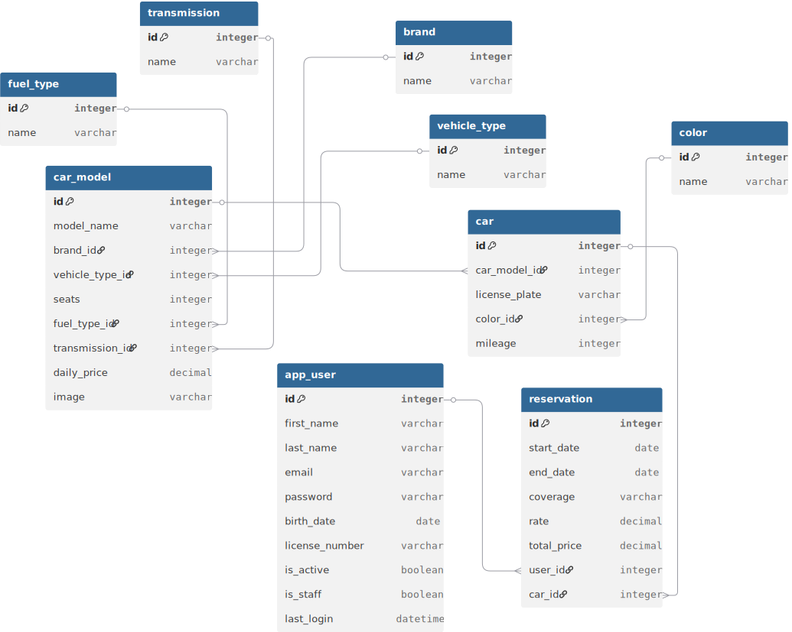

# 🚗 Vehicle Rental System

A **vehicle rental management system** developed as a **web application** based on a **REST API**.
This project provides a **complete CRUD API** for managing users, vehicles, and reservations.

---

## ✨ Features

* 🔐 User management
* 🚘 Vehicle management
* 📅 Reservation system
* 🛠️ Full CRUD operations
* 🌐 RESTful API architecture
* 🧑‍💼 Admin panel support

---

## 🚀 Quick Installation

Clone the repository and install dependencies:

```bash
git clone https://github.com/Bootcamp-IA-P6/Proyecto2_CRUD_Equipo5.git
cd Proyecto2_CRUD_Equipo5


# Create virtual environment
python -m venv venv


# Activate virtual environment
# Windows
venv\Scripts\activate


# Linux / macOS
source venv/bin/activate


# Install dependencies
pip install -r requirements.txt
```

---

## 🛠 Database Setup & Initialization
Follow these steps to set up the database schema and load initial sample data.

### 1. Create Database (Manual Step)
Before running migrations, you must manually create the database in your MySQL server:
```sql
CREATE DATABASE renting_db;
```


### 2. Environment Configuration
Create a `.env` file in the root directory and configure your credentials:
```env
DB_NAME=renting_db
DB_USER=root
DB_PASSWORD=your_mysql_password
DB_HOST=127.0.0.1
DB_PORT=3306

SECRET_KEY=your-django-secret-key
DEBUG=True
```


### 3. Database Migrations
Generate and apply the table schema:
```bash
python manage.py makemigrations
python manage.py migrate
```

If needed:
```bash
python manage.py createsuperuser
```


### 4. Seeding Sample Data
Run the custom management command to populate the database with 15 Users, 15 Cars, and 25 Reservations.
```bash
python manage.py seed_data
```

Note:
- This command ensures all users are created with properly hashed passwords, allowing immediate login via JWT.
- Reservations are created with automatically calculated prices and coverage levels (Young Driver, Standard, Senior/Premium) based on the users' birth dates.


### 5. Default Credentials
After seeding, you can log in with any of the 15 generated accounts.
- **Username**: user1@example.com ~ user15@example.com
- **Password (for all)**: pass1234

---

## ▶️ Run Project

Start the development server:

```bash
python manage.py runserver
```

🌐 Open in your browser:
**[http://localhost:8000](http://localhost:8000)**

---

## 🚀 API Endpoints Overview

For detailed request/response examples and JWT authentication flow, please refer to our [Full API Guide](./API_GUIDE.md).

| Category | Method | Endpoint | Auth Required |
| :--- | :--- | :--- | :--- |
| **Auth** | POST | `/api/token/` | No |
| **Users** | POST | `/api/users/` (Registration) | No |
| | GET | `/api/users/me/` | **Yes** |
| **Cars** | GET | `/api/cars/` | **Yes** |
| **Reservations**| GET | `/api/reservations/` | **Yes** |
| | POST | `/api/reservations/` | **Yes** |

### 🔒 Quick Note on Authentication
1. Login via `/api/token/` to receive an `access` token.
2. Include the token in the header: `Authorization: Bearer <your_token>`.

For detailed API usage and JWT authentication flow, please refer to the [API_GUIDE.md](./API_GUIDE.md).

---

## 🏗️ Project Structure

```text
renting/
├── models/         # User, Vehicle, Reservation
├── serializers/    # API serialization
├── views/          # CRUD logic
├── urls/           # API routes
├── templates/      # HTML pages
└── admin/          # Admin panel
```
---

## 📐 Database Diagram (ERD)

This diagram represents the **single source of truth** for our database structure and relationships. It includes all core entities: Users, Vehicles (Cars), and Reservations, along with their respective lookup tables.



### 📂 Database Schema Documentation

#### 1. Configuration & Master Tables
* **Brand:** Stores car manufacturers. [cite_start]It has a **1:N relationship** with `CarModel`[cite: 1, 23, 30].
* **VehicleType:** Defines categories (SUV, Sedan, etc.). [cite_start]It has a **1:N relationship** with `CarModel`[cite: 6, 23, 32].
* **FuelType:** Manages fuel variants (Diesel, Electric, etc.). [cite_start]It has a **1:N relationship** with `CarModel`[cite: 10, 23, 36].
* **Transmission:** Specifies gearbox types (Manual/Automatic). [cite_start]It has a **1:N relationship** with `CarModel`[cite: 20, 23, 38].
* **Color:** Stores the color palette. [cite_start]It maintains a **1:N relationship** with `Car`[cite: 13, 42, 49].

#### 2. Inventory Structure
* **CarModel:** The central entity for technical specifications and pricing. [cite_start]It has a **1:N relationship** with `Car`[cite: 23, 42, 45].
* [cite_start]**Car:** Represents the physical assets, including unique license plates and mileage[cite: 42, 47, 51].

#### 3. Business Logic & Operations
* **AppUser:** Custom user model for customers. [cite_start]It has a **1:N relationship** with `Reservation`[cite: 53, 60, 87].
* **Reservation:** The transactional entity linking users and cars for specific dates. [cite_start]It maintains **N:1 relationships** with both `AppUser` and `Car`[cite: 60, 87, 91].

---

## 📐 Database Diagram (ERD)

This diagram represents the final database schema, including business rules for coverage and price calculations.


---

## 📂 Database Schema Documentation

#### 1. Master Tables (Configuration)
* **Brand**: Stores manufacturers. 1:N relationship with `CarModel`.
* **VehicleType**: Defines categories (SUV, Sedan). 1:N relationship with `CarModel`.
* **FuelType**: Specifies energy source. 1:N relationship with `CarModel`.
* **Transmission**: Manual or automatic. 1:N relationship with `CarModel`.
* **Color**: Aesthetic property of each physical unit. 1:N relationship with `Car`.

#### 2. Inventory Relationships
* **CarModel**: Central table for specs and `daily_price`. 1:N relationship with `Car`.
* **Car**: Actual asset with license plate and mileage. 1:N relationship with `Reservation`.

#### 3. Business Relationships
* **AppUser**: Stores customer info. The `birth_date` determines the coverage level. 1:N relationship with `Reservation`.
* **Reservation**: Links user and car. Calculates `total_price` by multiplying `daily_price` by the applied `rate`.

---

## 🧰 Tech Stack

* 🐍 Python
* 🌐 Django
* 🔗 Django REST Framework
* 🐬 MySQL
* ⚙️ dotenv

---

## 📄 License

This project is for **educational purposes**.

---

💙 Built with passion by **Equipo 5**
